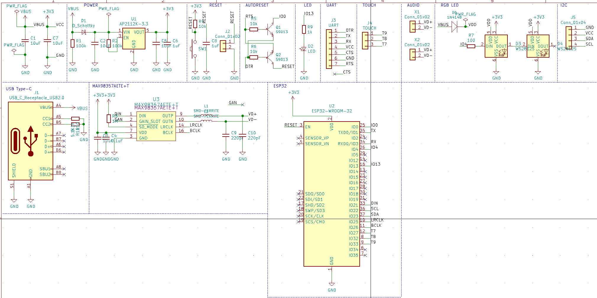

# ConnectedDoll PCB
ESP32 に MAX98357A搭載 I2S 3W D級アンプ その他を搭載したボード  
MP3再生は ファームウェア (ソフトウェアコーディック) を想定

# 基板CAD
[KiCAD 5.1.5](https://kicad-pcb.org/blog/2019/11/KiCad-5.1.5-Release/)

# 部品概要
部品詳細 は [bom](./bom/) 参照。  

|部品名|概要|
|:--|:--|
| ESP32-WROOM-32 | WiFi モジュール |
| MAX98357AETE+T | I2S 3W D級アンプ |
| WS2812S | シリアルLED |

# 回路図
回路図 詳細は [PDF](./esp32-mp3-board/esp32-mp3-board.pdf) 参照  

# 参考
[Adafruit HUZZAH32 - ESP32 Feather](https://learn.adafruit.com/assets/41630)  
[Adafruit MAX98357 I2S Class-D Mono Amp](https://learn.adafruit.com/assets/32642)  
[FTDI USBシリアル変換アダプター Rev.2](https://www.switch-science.com/catalog/2782/)  
[CHEATING AT 5V WS2812 CONTROL TO USE 3.3V DATA](https://hackaday.com/2017/01/20/cheating-at-5v-ws2812-control-to-use-a-3-3v-data-line/)